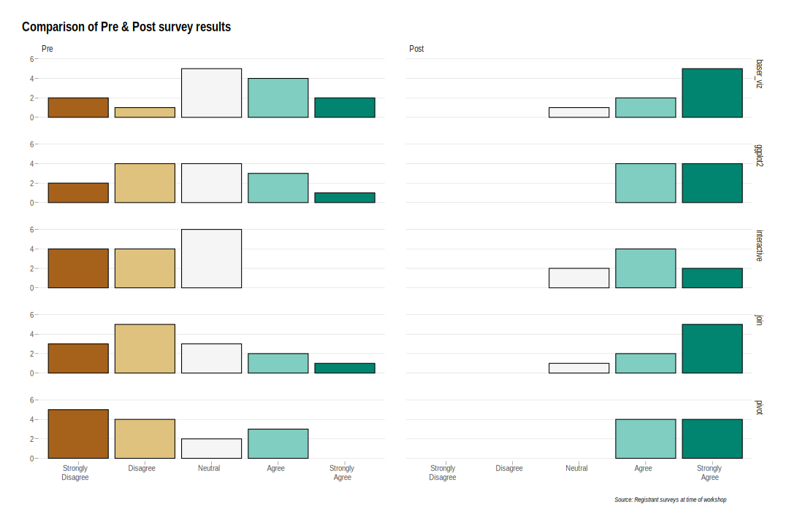

```{r}
library(tidyverse)
library(hrbrthemes)
```

## Ingest data

```{r message=FALSE, warning=FALSE}
pre <- read_csv("data/Pre_ggplot2_2020_02_18.csv") %>%
  mutate("survey" = "pre")
post <- read_csv("data/Post_ggplot2_2020_02_18.csv") %>% 
  mutate("survey" = "post")
```

## Wrangle data

Normalize column labels

```{r}
new_names_pre <- c("timestamp", "why_here", "tools_programming", 
                   "tools_dbms", "tools_git", "tools_os", 
                   "scatterplot_experience", "ggplot2_experience", 
                   "multilayer_experience",
                   "documentation_experience", 
                   "aes_experience", "shape_quiz",
                   "workflow_satisfaction",
                   "survey")
new_names_post <- c("timestamp", "scatterplot_experience",
                    "ggplot2_experience",
                    "multilayer_experience",
                    "documentation_experience",
                    "aes_experience", "shape_quiz",
                    "apply_learning", 
                    "learning_comfort", "clear_answers",
                    "intructor_enthusiasm",
                    "instructor_interaction",
                    "instructor_knowledge", "survey")


colnames(pre) <- new_names_pre
colnames(post) <- new_names_post

# colnames(pre)
# colnames(post)


```

make one table

```{r}
pre_post_tbl <- bind_rows(pre, post)
```

## Visualize

```{r big picture, fig.height=10, fig.width=12, message=FALSE, warning=FALSE}
pre_post_tbl %>% 
  select(timestamp, survey, ends_with("_experience")) %>% 
  pivot_longer(ends_with("_experience"),
               names_to = "experience") %>% 
  mutate(value = str_to_title(value)) %>% 
  mutate(value = fct_relevel(value, levels = c("Strongly Disagree",
                                       "Disagree",
                                       "Neutral", "Agree", 
                                       "Strongly Agree"))) %>% 
  mutate(experience = str_extract(experience, "\\w+(?=_)")) %>% 
  mutate(experience = fct_relevel(experience, levels = c(
    "scatterplot", "ggplot2", "aes", "multilayer", "documentation")
  )) %>% 
  ggplot(aes(value)) +
    geom_bar(aes(fill = value), color = "black") +
    facet_grid(experience ~ fct_rev(str_to_title(survey)))+ 
    scale_fill_brewer(palette = "BrBG") + 
    scale_y_continuous(breaks = c(0,3,6)) +
    hrbrthemes::theme_ipsum(grid = "Y", ticks = TRUE) +
    theme(legend.position="none", plot.title.position = "plot") +
  labs(title = "Comparison of Pre & Post survey results",
       x = "", y = "",
       caption = "Source: Registrant surveys at time of workshop")

ggsave("output/images/big_picture.svg")
```


